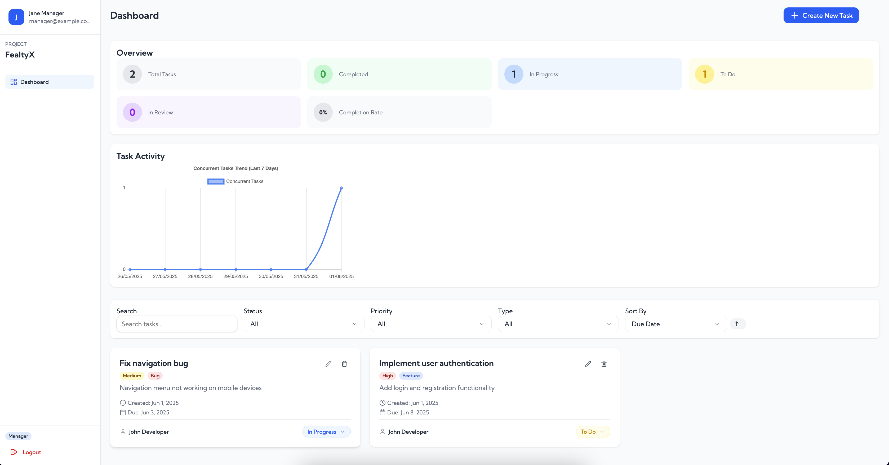

# Task Management System



A modern task management system built with Next.js, featuring role-based access control, task tracking, and a beautiful UI.

## Features

### Authentication & Authorization

- Role-based access control (Manager and Developer roles)
- Secure login system
- Persistent authentication state

### Task Management

- Create, read, update, and delete tasks
- Task status tracking (To Do, In Progress, Review, Done)
- Priority levels (Low, Medium, High, Urgent)
- Task types (Feature, Bug, Improvement)
- Due date management
- Task assignment to team members

### Task Organization

- Filter tasks by:
  - Status
  - Priority
  - Type
  - Assignee
  - Search text
  - Date range
- Sort tasks by:
  - Due date
  - Priority (Urgent tasks always appear first)
  - Creation date

### Task Details

- Title and description
- Status updates
- Priority indicators
- Type classification
- Due date tracking
- Creation date
- Assignee information
- Tags and labels

### UI/UX Features

- Responsive design
- Modern and clean interface
- Interactive task cards
- Status color coding
- Priority-based visual indicators
- Hover effects and transitions
- Tooltips for additional information

## Prerequisites

- Node.js 18.x or later
- npm or yarn package manager

## Getting Started

1. Clone the repository:

```bash
git clone <repository-url>
cd fealtyx-assignment
```

2. Install dependencies:

```bash
npm install
# or
yarn install
```

3. Run the development server:

```bash
npm run dev
# or
yarn dev
```

4. Open [http://localhost:3000](http://localhost:3000) in your browser

## Login Credentials

### Manager Account

- Email: manager@example.com
- Password: man123

### Developer Account

- Email: developer@example.com
- Password: dev123

## Project Structure

```
src/
├── app/                    # Next.js app directory
│   ├── (auth)/            # Authentication routes
│   └── (protected)/       # Protected routes
├── components/            # React components
│   ├── core-ui/          # Reusable UI components
│   └── tasks/            # Task-related components
├── store/                # State management
├── types/                # TypeScript type definitions
└── utils/                # Utility functions
```

## Technologies Used

- [Next.js](https://nextjs.org/) - React framework
- [TypeScript](https://www.typescriptlang.org/) - Type safety
- [Tailwind CSS](https://tailwindcss.com/) - Styling
- [Zustand](https://github.com/pmndrs/zustand) - State management
- [Lucide React](https://lucide.dev/) - Icons
- [Geist Font](https://vercel.com/font) - Typography

## Development

### Code Style

- Follow TypeScript best practices
- Use functional components with hooks
- Implement proper type definitions
- Follow the project's component structure

### State Management

- Use Zustand for global state
- Implement proper state persistence
- Handle loading and error states

### Styling

- Use Tailwind CSS for styling
- Follow the project's color scheme
- Maintain consistent spacing and typography

## Contributing

1. Fork the repository
2. Create your feature branch (`git checkout -b feature/amazing-feature`)
3. Commit your changes (`git commit -m 'Add some amazing feature'`)
4. Push to the branch (`git push origin feature/amazing-feature`)
5. Open a Pull Request

## License

This project is licensed under the MIT License - see the LICENSE file for details.
